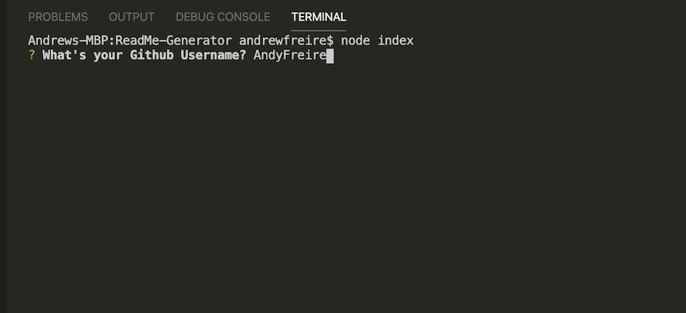

# ReadMe Generator

## Description 

This is a CLI application to generate nice ReadMe files using Inquirer and NodeJS

## Table of Contents

    * [Installation](#installation)
    * [Usage](#usage)
    * [Credits](#credits)
    * [License](#license)

## Installation

Simply install the node modules with npm install.

## Usage 

Run node index in the terminal to start the application. Follow the prompts to generate your readme file!

## Credits

Inquirer was used for this application

## License

## Badges

 

## Contributing

Feel free to contribute to this project. No defamatory language or actions allowed.

---

## Questions

Feel free to contact me via my profile

